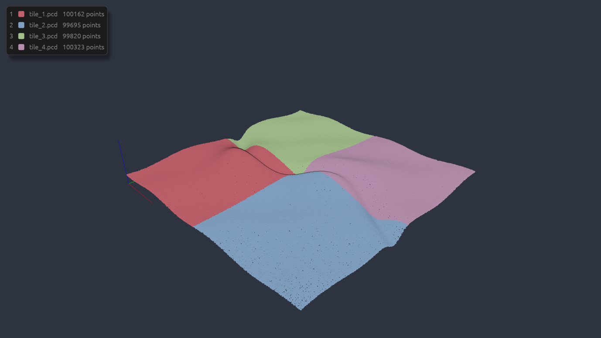
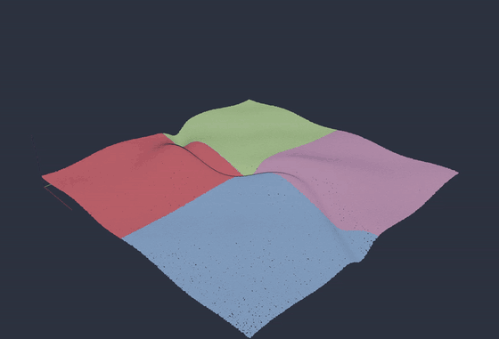
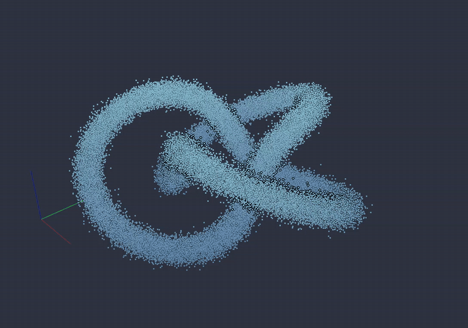
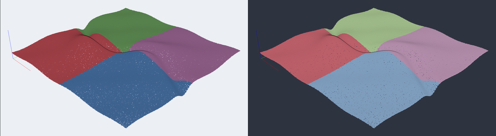

# tridi

A fast viewer for point clouds, meshes and STEP files on Linux, and the
thumbnails for them in Nautilus (GNOME Files). One Rust binary does both:
a window for looking at the files, and `tridi thumb`, which Nautilus calls
to draw their previews without a window or a GPU.

- Point clouds: `.pcd` (ascii, binary, binary_compressed; rgb from PCL or
  Open3D), `.ply` without faces, `.xyz`, `.xyzrgb`, `.pts`.
- Meshes: `.glb`/`.gltf` (materials and textures), `.obj`, `.stl`, `.off`,
  `.ply` with faces.
- CAD: `.step`/`.stp` (assemblies and colors), tessellated in Rust with
  monstertruck. A file the library can't finish in 15 s is an error.

## Features

| | |
|---|---|
|  | **Navigation**: left drag orbits, right or middle drag (or shift + left) pans, the wheel zooms, `R` resets the view. |
|  | **Several files at once**, one color each, so they tell apart; `1`–`9` turn the N-th file off and on, and a legend top left says which is which (`I` hides it); `H` or `?` shows the keys. A file's own colors always win. |
|  | **Point size** with `+` and `-`; eye-dome lighting gives the cloud its depth. |
|  | **Two themes** (Nord light and dark) for the window and the thumbnails: `tridi theme dark`. |

## Install (Arch)

From [a release](https://github.com/rccnroll/tridi/releases/latest): download `tridi-*.pkg.tar.zst` and `sudo pacman -U` it.
From the repo (builds the committed HEAD):

    cd packaging/arch && makepkg -si

## Install (Ubuntu 24.04, Debian 12+)

From [a release](https://github.com/rccnroll/tridi/releases/latest): download `tridi_*.deb` and `sudo apt install ./tridi_*.deb`.
From the repo (builds the committed HEAD in a Debian 12 container, podman):

    packaging/deb/build.sh

Then, once per user:

    tridi theme dark         # or: tridi theme light (both Nord)
    gsettings set org.gnome.nautilus.preferences thumbnail-limit 100

`tridi theme` sets the look of the viewer and the thumbnails, and clears
the cached thumbnails of these formats so Nautilus redraws them. It has to
run once either way: it writes tridi's thumbnailer entry to
`~/.local/share/thumbnailers/`, where it wins over f3d's (f3d, if
installed, claims glb, stl and obj too), and makes tridi the default app
for these formats (`xdg-mime default`), which a package can't do for its
users. When an upgrade adds a format, the viewer updates both the next
time it opens.

The `gsettings` line lets Nautilus thumbnail files up to 100 MB (the
default stops at 50). The package itself clears every user's cached
thumbnails of these formats on install and upgrade.

## Use

    tridi FILE [FILE ...]              # open files together
    tridi thumb IN OUT SIZE            # what Nautilus runs
    tridi theme [light|dark]           # show or switch the theme
    tridi clear-thumbnails [DIR ...]   # drop cached thumbnails of these formats

`--theme light|dark` overrides the saved theme for one run. `tridi --help`
(or `tridi thumb --help`, …) and `man tridi` have the examples, formats
and keys.

In the window: left drag orbits, right or middle drag (or shift + left drag)
pans, the wheel zooms; `R` resets the view, `+`/`-` change the point size,
`1`–`9` turn the N-th file off and on, `I` hides the legend, `H` or `?`
shows the keys, `Q` or `Esc` quits.

One file is colored by height (Z); several files get one color each, so
they tell apart. A file's own colors always win, and meshes keep their
materials. glTF opens Y-up, as its standard says; everything else Z-up.
Point clouds get eye-dome lighting, which gives them depth.

The window and the thumbnails always render on the integrated GPU (never
the NVIDIA one: waking it costs seconds), and thumbnails fall back to
llvmpipe inside Nautilus's sandbox, which has no GPU. `TRIDI_DEBUG=1`
prints which device is used.

## Develop

    cargo test                   # one test renders on llvmpipe (Mesa, no GPU)
    cargo run --release -- FILE

How the code is laid out, what CI checks, fuzzing, the commit style and how
a release is cut are in
[CONTRIBUTING.md](CONTRIBUTING.md); what changed in each release in
[CHANGELOG.md](CHANGELOG.md). Security issues go through
[SECURITY.md](SECURITY.md), not the issues.

## History

1.0 was Python + Open3D launched by `uv`, with an f3d-drawn thumbnailer,
kept in dotfiles; this repository starts at 2.0, the Rust rewrite, which
dropped STEP until it came back in Rust after 2.1. Up to 2.2.0 it was
called pcdview (same tags, same history).
Why and how is in [docs/history.md](docs/history.md).

## License

MIT or Apache-2.0, at your option: [LICENSE-MIT](LICENSE-MIT),
[LICENSE-APACHE](LICENSE-APACHE).
