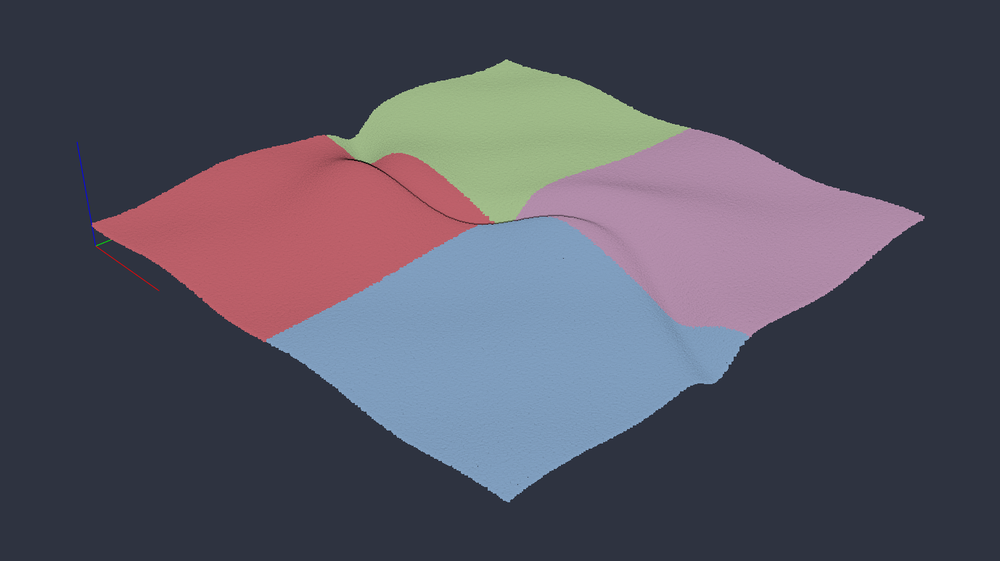
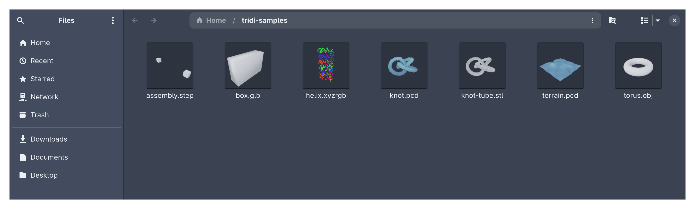

# tridi

A fast viewer for point clouds, meshes and STEP files on Linux, and the
thumbnails for them in Nautilus (GNOME Files). One Rust binary does both:
a window for looking at the files, and `tridi thumb`, which Nautilus calls
to draw their previews without a window or a GPU.

- Point clouds: `.pcd` (ascii, binary, binary_compressed; rgb from PCL or
  Open3D), `.ply` without faces, `.xyz`, `.xyzrgb`, `.pts`.
- Meshes: `.glb`/`.gltf` (materials and textures), `.obj`, `.stl`, `.off`,
  `.ply` with faces.
- CAD: `.step`/`.stp` (assemblies and colors), tessellated in Rust with
  monstertruck. A file the library can't finish in 15 s is an error.

## Install (Arch)

From a release: download `tridi-*.pkg.tar.zst` and `sudo pacman -U` it.
From the repo (builds the committed HEAD):

    cd packaging/arch && makepkg -si

## Install (Ubuntu 24.04, Debian 12+)

From a release: download `tridi_*.deb` and `sudo apt install ./tridi_*.deb`.
From the repo (builds the committed HEAD in a Debian 12 container, podman):

    packaging/deb/build.sh

Then, once per user:

    tridi theme dark         # or: tridi theme light (both Nord)
    gsettings set org.gnome.nautilus.preferences thumbnail-limit 100

`tridi theme` picks the look of both the viewer and the thumbnails, and
clears the cached thumbnails of these formats so Nautilus redraws them. It
also has to run once for the thumbnails to be ours: f3d, if installed, claims
glb, stl and obj too, and `tridi theme` writes our entry where it wins
(`~/.local/share/thumbnailers/`). It also makes tridi the default app for
these formats (`xdg-mime default`), which a package can't do for its users;
if an upgrade adds a format, the next time the viewer opens it brings both
up to date. The second line lets Nautilus thumbnail
files up to 100 MB (the default stops at 50). The package clears every
user's cached thumbnails of these formats on install and upgrade.

## Use

    tridi FILE [FILE ...]              # open files together
    tridi thumb IN OUT SIZE            # what Nautilus runs
    tridi theme [light|dark]           # show or switch the theme
    tridi clear-thumbnails [DIR ...]   # drop cached thumbnails of these formats

`--theme light|dark` overrides the saved theme for one run. `tridi --help`
(or `tridi thumb --help`, …) and `man tridi` have the examples, formats
and keys.

In the window: left drag orbits, right or middle drag (or shift + left drag)
pans, the wheel zooms; `R` resets the view, `+`/`-` change the point size,
`1`–`9` turn the N-th file off and on, `Q` or `Esc` quits.

One file is colored by height (Z); several files get one color each, so
they tell apart. A file's own colors always win, and meshes keep their
materials. glTF opens Y-up, as its standard says; everything else Z-up.
Point clouds get eye-dome lighting, which gives them depth.

The window and the thumbnails always render on the integrated GPU (never
the NVIDIA one: waking it costs seconds), and thumbnails fall back to
llvmpipe inside Nautilus's sandbox, which has no GPU. `TRIDI_DEBUG=1`
prints which device is used.

## What's here

- `src/main.rs` — command line, window and navigation.
- `src/cloud.rs` — point cloud readers (pcd, ply, xyz/pts, off) and the
  coloring rules.
- `src/mesh.rs` — meshes (through `three-d-asset`, plus ply/off faces), and
  which files are clouds and which meshes.
- `src/render.rs` — the scene, eye-dome lighting, the headless EGL context
  and the offscreen thumbnail.
- `src/theme.rs` — the two themes, `tridi theme` and the thumbnail cache.
- `share/` — thumbnailer entry, MIME types, `.desktop`, icons (one SVG, the
  rest symlinks to it).
- `packaging/arch/` — PKGBUILD and install script.
- `packaging/deb/` — `.deb` build (cargo-deb, metadata in `Cargo.toml`) and `postinst`.
- `tests/data/` — small fixtures written by Open3D.
- `docs/` — the README's screenshots and the script that makes their files.

## Develop

    cargo test                   # one test renders on llvmpipe (Mesa, no GPU)
    cargo run --release -- FILE

CI runs `cargo fmt --check`, clippy with `-D warnings` and the tests on
every push, and checks the build on the oldest Rust supported (1.88). The
screenshots come from synthetic files: `python3 docs/samples.py`.

## History

1.0 (tag `v1.0.0`) was Python + Open3D launched by `uv`, with an f3d-drawn
thumbnailer; 2.0 replaces it and dropped STEP, which came back in Rust
after 2.1. Up to 2.2.0 it was called pcdview (same tags, same history).
Why and how is in [ROADMAP.md](ROADMAP.md).

## License

MIT or Apache-2.0, at your option: [LICENSE-MIT](LICENSE-MIT),
[LICENSE-APACHE](LICENSE-APACHE).
